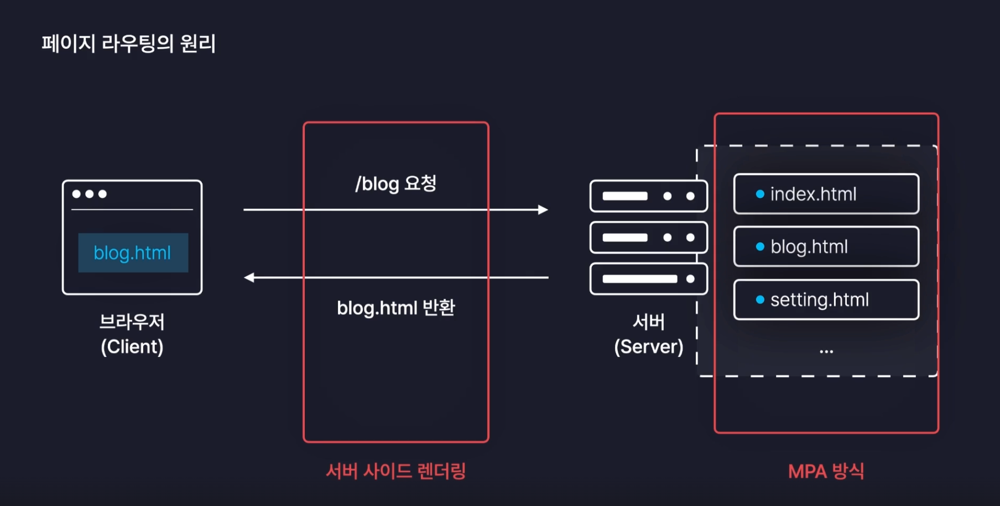

# 감정일기장

## 프로젝트 정보

```markdown
- node: v20.16.0
- npm: v10.8.1
- react: v18.3.1
- vite: v5.4.10
- 실행: npm run dev
```

## 라우터

### 페이지 라우팅

- 경로에 따라 알맞은 페이지를 렌더링
- 전통적인 웹서비스들은 서버에서 html 파일을 가지고 있고(MPA) 브라우저에서 특정 주소를 가진 페이지를 요청하면 서버에서 html을 반환 받아 브라우저에서 렌더링(SSR)
  
- 리액트는 html을 하나만 가지고 있으면서 서버에 요청시 index.html 파일 하나만 제공받아(SPA) 브라우저에서는 자바스크립트 파일을 실행하여 화면을 렌더링(CSR)
  - 여러 자바스크립트 파일은 번들러 vite로 인해 하나의 자바스크립트 파일로 번들링 되어 제공되어 실행됨

### React Router

- 대다수의 리액트 앱이 사용하고 있는 대표적 라이브러리
- `path="*"`는 와일드카드 `switch`문의 `default` 같은 기능

```zsh
npm i react-router-dom
```

#### Routes, Route 컴포넌트

- `Routes` 컴포넌트 내부에는 `Route` 컴포넌트만 사용가능
- `Routes` 컴포넌트 밖에 배치된 요소들은 모든 페이지에 동일하게 렌더링됨

#### Link 컴포넌트

- `Link` 링크로 컴포넌트로 페이지 이동을 제공함

#### useNavigate 커스텀 훅

- `useNavigate` : 이벤트 발생으로 특정 페이지 이동을 지원하는 훅
- 페이지가 mount된 이후 사용 가능. mount 전 사용하기 위해선 `useEffect()`를 사용해야 함

#### 동적 경로

**동적 경로 방식**

- URL Parameter 방식

  - / 뒤에 아이템 id를 명시
  - 아이템의 id 등의 변경되지 않는 값을 주소로 명시하기 위해 사용
  - `useParams` : 현재 브라우저의 parameter를 가지고 오는 커스텀 훅

  ```jsx
  import { useParams } from "react-router-dom";
  const Diary = () => {
    const params = useParams();
    return <div>{params.id}번 일기</div>;
  };
  ```

- Query String 방식
  - ? 뒤에 변수명과 값 명시
  - 검색어 등의 자주 변경되는 값을 주소로 명시하기 위해 사용
  - `useSearchParams` : 현재 브라우저의 쿼리스트링의 값을 가지고 오는 커스텀 훅
  ```jsx
  import { useSearchParams } from "react-router-dom";
  const Home = () => {
    const [params, setParams] = useSearchParams();
    // params - 쿼리스트링의 값
    // setParams - 쿼리스트링 값을 변경하는 함수
    console.log(params.get("value"));
    return <div>Home</div>;
  };
  ```

```jsx
import { Routes, Route, Link, useNavigate } from "react-router-dom";

function App() {
  const nav = useNavigate();
  const onClickButton = () => {
    nav("/new");
  };

  return (
    <>
      <div>
        <Link to={"/"}>Home</Link>
        <Link to={"/new"}>New</Link>
        <Link to={"/diary"}>Diary</Link>
      </div>
      <Routes>
        <Route path="/" element={<Home />}></Route>
        <Route path="/new" element={<New />}></Route>
        <Route path="/diary/:id" element={<Diary />}></Route>
        <Route path="*" element={<Notfound />}></Route>
      </Routes>
    </>
  );
}
```

## 이미지

- vite 번들러 사용시 이미지를 assets 폴더에 넣으면 이미지 최적화가 진행됨

## 커스텀훅 VS 모듈 파일

### 커스텀 훅

- 재사용한 가능한 로직을 묶어 만드는 함수
- 이름은 use로 시작해야함
- 상태(state)나 효과(effect)를 관리할 때 주로 사용
- 사용하는 경우
  - 여러 컴포넌트에서 동일한 로직(데이터 가져오기, 폼 핸들링 등)을 사용할 때
  - 특정 기능을 상태와 함께 캡슐화하고 싶을 때

### 모듈 파일

- 특정 기능을 모아두는 일반적인 자바스크립트 파일
- 보통 유틸리티 함수, API 요청 로직, 상수 등을 모듈 파일로 관리
- 상태를 가지지 않고, 단순한 함수나 데이터를 export할 때 사용
- **사용하는 경우**
  - 특정 기능이 리액트 훅을 사용할 필요가 없고, 상태를 관리하지 않을 때
  - 유틸 함수(문자열 변환, 날짜 포맷 등)나 API 요청을 관리할 때

## 웹스토리지

- 웹 브라우저에 기본적으로 내장되어 있는 데이터 베이스
- 별도의 프로그램, 라이브러리 설치 필요 없음
- 그냥 자바스크립트 내장함수 만으로 접근 가능

### SessionStorage

- 브라우저 탭 별로 데이터를 보관
- 탭이 종료되기 전에는 데이터 유지 (새로고침)
- 탭이 종료되거나 꺼지면 데이터 삭제

### LocalStorage

- 사이트 주소별로 데이터 보관
- 사용자가 직접 삭제하기 전까지 데이터 보관
